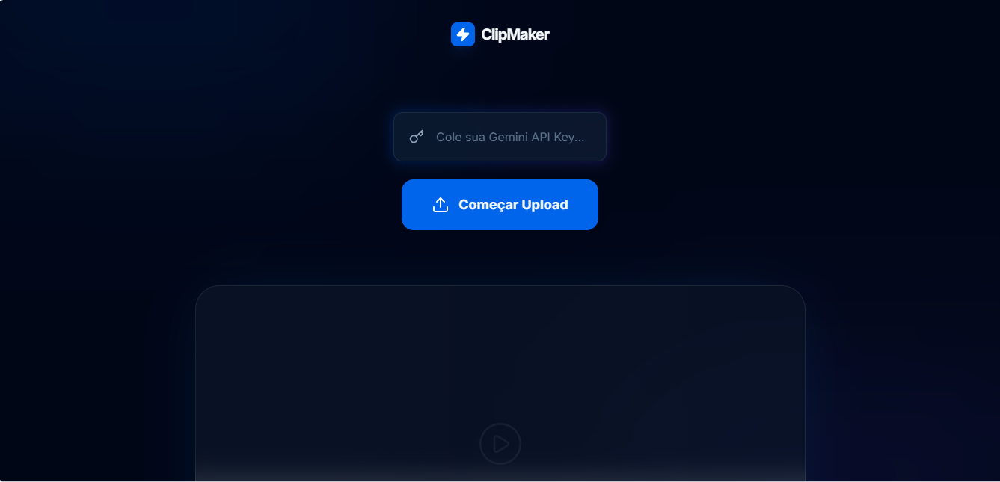

# 🎬 Viral Clip Generator - NLW

Este projeto é um gerador de momentos virais que utiliza **Inteligência Artificial** para analisar transcrições de vídeos e identificar os trechos mais engajadores. Desenvolvido para transformar vídeos longos em cortes curtos e impactantes de forma automatizada.

---

## 🚀 Tecnologias

* **HTML5 & Tailwind CSS**: Interface moderna e responsiva.
* **JavaScript (Vanilla)**: Lógica principal e manipulação de DOM.
* **Cloudinary**: Hospedagem, upload de vídeos e geração de transcrições via IA.
* **Google Gemini AI**: Processamento de linguagem natural para identificar os melhores momentos.
* **GSAP**: Animações fluidas de entrada e transição.
* **Lucide Icons**: Ícones minimalistas e elegantes.

---

## 🛠️ Como Funciona?

1.  **Upload**: O usuário envia um vídeo através do widget do Cloudinary.
2.  **Transcrição**: O serviço gera automaticamente o texto do que foi dito no vídeo.
3.  **Análise de IA**: A transcrição é enviada para o **Gemini 1.5 Flash** com um prompt especializado em retenção de público.
4.  **Corte Inteligente**: A IA retorna os timestamps (início e fim) ideais para um clip de 30 a 60 segundos.
5.  **Exibição**: O vídeo é renderizado na tela utilizando as transformações de URL do Cloudinary para exibir apenas o trecho selecionado.